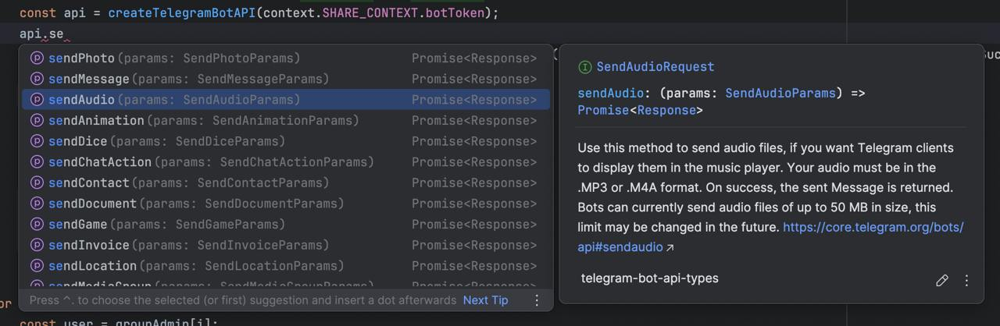

# telegram-bot-api-types

Telegram Bot API SDK compiled size is 0KB that only includes type definition files. It can be used to conveniently develop Telegram Bots in TypeScript. You can wrap your API client with as many web request libraries as you want.

This is a `d.ts` and `jsdoc` file for Telegram Bot API. It is based on the official [Telegram Bot API](https://core.telegram.org/bots/api) documentation. 





### Installation

```sh
npm i telegram-bot-api-types --save-dev
```

### Example

You can use any HTTP request library you want to encapsulate your API client. Here is a simple echo bot.

```typescript
import * as Telegram from "telegram-bot-api-types"; // useing the type definitions with namespace
import * as fs from 'node:fs';

class APIClientBase {
    readonly token: string;
    readonly baseURL: string = `https://api.telegram.org/`;
    constructor(token: string, baseURL?: string) {
        this.token = token;
        if (baseURL) {
            this.baseURL = baseURL;
        }
    }

    private jsonRequest<T>(method: Telegram.BotMethod, params: T): Promise<Response> {
        return fetch(`${this.baseURL}bot${this.token}/${method}`, {
            method: 'POST',
            headers: {
                'Content-Type': 'application/json',
            },
            body: JSON.stringify(params),
        });
    }

    private formDataRequest<T>(method: Telegram.BotMethod, params: T): Promise<Response> {
        const formData = new FormData();
        for (const key in params) {
            const value = params[key];
            if (value instanceof File) {
                formData.append(key, value, value.name);
            } else if (value instanceof Blob) {
                formData.append(key, value, 'blob');
            } else if (typeof value === 'string') {
                formData.append(key, value);
            } else {
                formData.append(key, JSON.stringify(value));
            }
        }
        return fetch(`${this.baseURL}bot${this.token}/${method}`, {
            method: 'POST',
            body: formData,
        });
    }

    request<T>(method: Telegram.BotMethod, params: T): Promise<Response> {
        for (const key in params) {
            if (params[key] instanceof File || params[key] instanceof Blob) {
                return this.formDataRequest(method, params);
            }
        }
        return this.jsonRequest(method, params);
    }

    async requestJSON<T, R>(method: Telegram.BotMethod, params: T): Promise<R> {
        return this.request(method, params).then(res => res.json() as R) 
    }
}


type APIClient = APIClientBase & Telegram.AllBotMethods<Response>;

export function createAPIClient(token: string): APIClient {
    const client = new APIClientBase(token);
    return new Proxy(client, {
        get(target, prop, receiver) {
            if (prop in target) {
                return Reflect.get(target, prop, receiver);
            }
            return (...args: any[]) => {
                if (typeof prop === 'string' && prop.endsWith('WithReturns')) {
                    const method = prop.slice(0, -11) as Telegram.BotMethod;
                    return Reflect.apply(target.requestJSON, target, [method, ...args]);
                }
                return Reflect.apply(target.request, target, [prop as Telegram.BotMethod, ...args]);
            };
        }
    }) as APIClient;
}

async function main() {
    const { token } = JSON.parse(fs.readFileSync('config.json', 'utf8'));
    const client = createAPIClient(token);
    const { result: user } = await client.getMeWithReturns()
    console.log(`Hello! My name is ${user.username}`);
    await client.deleteWebhook({});
    while (true) {
        const { result: updates } = await client.getUpdatesWithReturns({ offset: 0 });
        for (const update of updates) {
            if (update.message) {
                await client.sendMessageWithReturns({ chat_id: update.message.chat.id, text: update.message.text });
            }
        }
    }
}

main().catch(console.error);

```

You don't need to implement the methods one by one, you can use the `Proxy` object to create a client that automatically calls the methods.


## License

**telegram-bot-api-types** is released under the MIT license. [See LICENSE](LICENSE) for details.